::: {.columns}
::: {.column width="65%"}
Hello, I'm an applied mathematician working on neural networks, optimization, mathematical physics, and other topics.

[My Google Scholar](https://scholar.google.com/citations?user=wNSSr_gAAAAJ). 
Email to: yarotsky at Google mail.

Below is some of my work.
:::
::: {.column width="35%"}
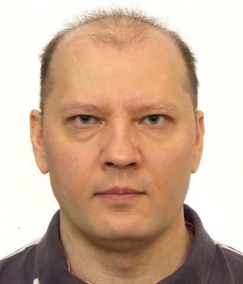{width=50% fig-align="center"}
:::
:::

### Learning regimes and loss evolution via diagram expansions 

For nonlinear machine learning models, it is generally difficult to theoretically derive explicit gradient flow trajectories. 
Moreover, while there are special regimes such as underparameterized, overparameterized, NTK, mean-field, etc., 
in which the model may be solvable, there seems to be no general classification of these regimes. 

We propose such a classification based on small-$t$ power-series expansion of the loss evolution [@yarotsky2026gradient]:
$$L(t)\sim\sum_{s=0}^{\infty}(\tfrac{1}{2}D-R)^{\star(s+1)}\frac{(-t)^s}{s!}$$
The terms $D$ and $R$ correspond to self-interaction of the model and the model-target interaction, respectively. 
For some problems such as fitting a tensor by a finite-rank approximation, 
the terms of the expansion have a suggestive interpretation as *diagrams* (akin to [Feynman diagrams](https://en.wikipedia.org/wiki/Feynman_diagram)). 
There is a "diagram calculus" describing various operations with the power series coefficients. 
Different types of diagrams correspond to different problems or extreme learning regimes. 

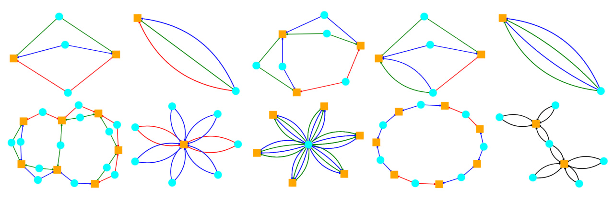{width=80% fig-align="center"}

In some cases, the series of diagrams can be summed to produce results well matching the experiment.

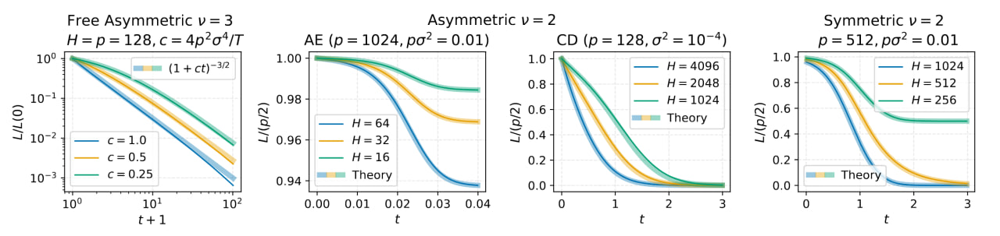{width=90% fig-align="center"}   

<!--
### Corner Gradient Descent  - TODO

### (S)GD with general linear memory - TODO
--->

### Learnability of high-dimensional targets by two-parameter models

In machine learning, it is usually expected that to learn objects forming a $d$-dimensional manifold one needs 
a model with $d$ or more parameters. A larger number of parameters can in fact help to avoid spurious local minima and reach a good fit. 

Nevertheless, we can ask if a more or less reliable learning by gradient flow is still possible if the number of parameters is *smaller* than the dimension of the target manifold. 
It is not hard to show that this setting has various pathological features: for example, the target manifold must have a dense subset of non-learnable targets.

However, I show in [@yarotsky2024learnability] that, given a probability distribution on the $d$-dimensional target manifold, it is possible to construct a 2-parameter model 
that will successfully learn targets by gradient flow with arbitrarily high probability. The learnable targets form a fat Cantor subset, and one of the two parameters controls the proximity 
of the model to the set of learnable targets, while the other controls the position along the "Cantor boundary".  

::: {style="text-align: center;"}	
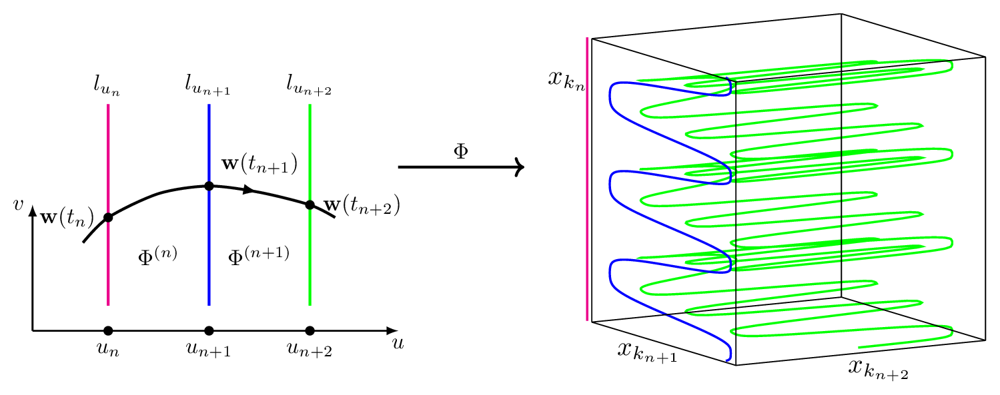{width=70% fig-align="center"}
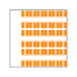{width=25% fig-align="center"}
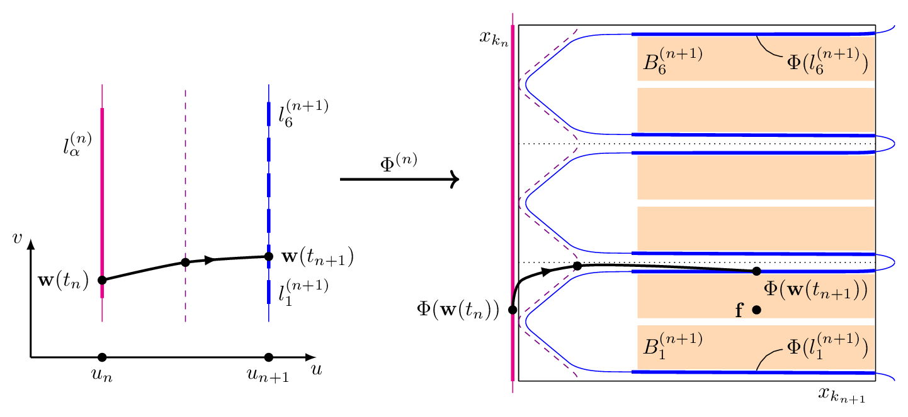{width=70% fig-align="center"}
::: 

### Elementary superexpressive activations
			
The well-known [universal approximation theorem](https://en.wikipedia.org/wiki/Universal_approximation_theorem)
states that neural networks can approximate any function with arbitrarily small error if we make the network large enough. 
But can we achieve this *without* increasing the network? Maiorov and Pinkus 
[have shown](https://pinkus.net.technion.ac.il/files/2021/02/neurocomp.pdf)
in 1999 that this is possible if we use some very special activation functions - 
a fixed-size network can then fit any continuous function on any compact domain with any accuracy 
merely by adjusting the weights. The respective activation functions are analytic and monotone, 
but otherwise quite complicated, in particular not elementary. 

I proposed to call such activations "**superexpressive**" and proved that there 
exists *elementary* superexpressive activations [@yarotsky2021elementary]. 
The proof relies significantly on the 
[density of irrational flow on the torus](https://en.wikipedia.org/wiki/Linear_flow_on_the_torus). 
For example, the network in the picture with activations $\sin$ and $\arcsin$ 
is such a superexpressive network for functions $f:[0,1]^2\to\mathbb R$.
At the same time, common non-periodic activations such as sigmoid, ReLU, ELU, softplus, etc. are 
<i>not</i> superexpressive. 

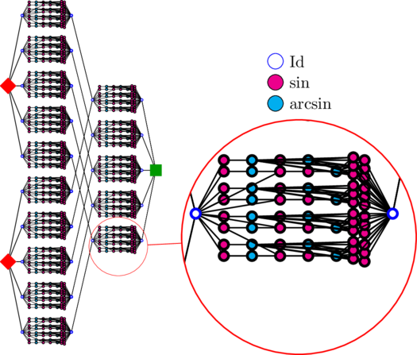{width=50% fig-align="center"}

### Phase diagram of approximation rates for deep ReLU networks

In this work we describe a complete phase diagram of approximation rates for deep ReLU networks [@yarotsky2020phase]. 
We assume that the target function $f$ belongs to a Hölder ball $F_{r,d}$ that, roughly speaking, 
consists of $d$-variate functions having bounded derivatives up to order $r$. 
We then ask for which exponents $p$ we can find approximations $\widetilde f_W$ of such $f$ 
by ReLU networks with $W$ weights so that $\|f-\widetilde f_W\|_\infty=O(W^{-p})$ as $W\to\infty$.  

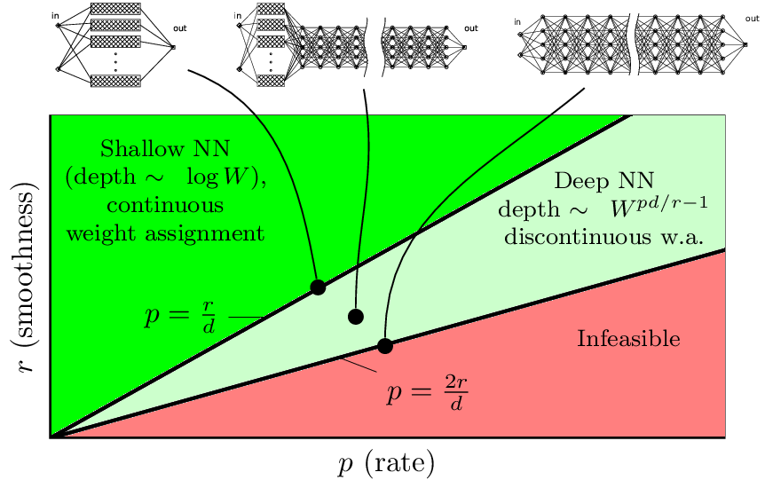{width=60% fig-align="center"}

It turns out that there are two very different regimes. The "slower" regime provides approximation rates up to $p=\tfrac{r}{d}$. 
This regime can be implemented by relatively shallow networks, and so that their weights depend continuously on the target. 
This regime is rather similar to classical linear approximation methods such as spline or Fourier expansion.    

The "faster" regime is based on an entirely different idea of "weight encoding" (rather than linear constructions). 
This regime can provide approximation rates up to $p=\tfrac{2r}{d}$. It requires network depths 
to grow as a power law in $W$; in particular, at $p=\tfrac{2r}{d}$ the network size fully "goes into the depth" rather than the width.
The weight precision also must grow as a power law in $W$. The weight assignment in this regime is fundamentally discontinuous.

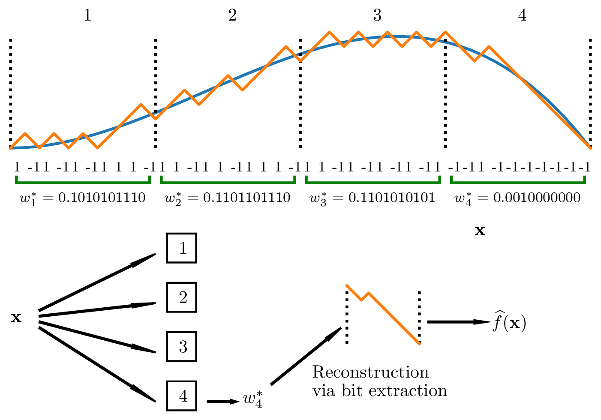{width=60% fig-align="center"}

### Universal approximation of invariant maps
			
An important idea in machine learning is to exploit the natural *invariance* (or more generally, *equivariance*) 
of target maps with respect to various groups of transformations (e.g., shifts, rotations, reflections, etc.). 
Building the relevant symmetry into the models generally makes them more efficient in terms of accuracy, complexity or training time. 
A standard example is the [convolutional networks](https://en.wikipedia.org/wiki/Convolutional_neural_network) 
that are designed to be invariant with respect to grid translations.      

I analyzed neural networks that are 
**invariant and universal** with respect to various groups of transformations [@yarotsky2022universal]. This means that the network must be not only invariant, but also capable of approximating 
any invariant map. This question is especially subtle in the case of groups such as the Euclidean rotation group, because it cannot be exactly 
implemented on finite grids on which the data is usually defined. It turns out that one can still rigorously describe neural network-type 
models that are provably *invariant and universal* even for this group, by considering a suitable limiting process 
(specifically, a map on the space of signals on $\mathbb R^2$ is continuous and SE(2)-equivariant if and only if it can be approximated 
by models of suitable architecture in the limit of infinitely detailed discretization).

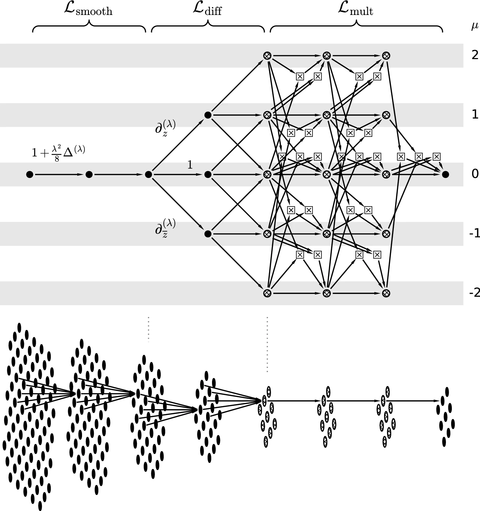{width=60% fig-align="center"}

### Discontinuous weight selection and emergence of subprograms

There is a general DeVore-Howard-Micchelli theorem establishing upper
bounds on approximation rates of any parameterized approximation model
(for example, a neural network) under assumption of continuous
parameter selection. However, if the assumption of continuity is
dropped, deep neural nets with a rather standard (but deep!)
architecture and the standard ReLU activation function can surpass
these bounds. This can be achieved by speeding up the computation with
something like *subprograms* [@yarotsky2017quantified]. 
This construction is inspired by a construction used by Shannon in his work on Boolean circuits.

::: {style="text-align: center;"}	
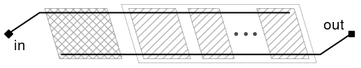{width=50% fig-align="center"}  
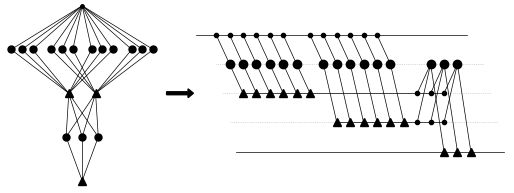{width=50% fig-align="center"}
:::
			

### Explicit loss asymptotics in neural network training
	
Network training by gradient descent based algorithms is a complex process that is generally hard to analyze theoretically. 
In the paper [@velikanov2021explicit] we have shown that under 
some reasonably general assumptions on the target function one can rather accurately describe the asymptotic evolution of the loss
under gradient descent in the [NTK regime](https://en.wikipedia.org/wiki/Neural_tangent_kernel). 
									
The asymptotic behavior is given by a power law $L(t)\sim Ct^{-\xi}$, where not only the exponent $\xi$ but also the 
coefficient $C$ can be written analytically. Our assumptions roughly say that the data distribution $\mu$ is smooth and generic while 
the target is characterized by singularities of "particular order and extent". The exponent $\xi$ is then universal in the sense that it is 
only determined by the dimension of data and the type of singularity in the target and the network activation. The coefficient $C$ is more complicated, but can still be written 
in terms of some integral expressions. For example, if the target belongs to the class of indicator functions of domains $\Omega\subset\mathbb R^d$ 
with smooth boundary, the loss evolves by
$$L(t)\sim\int_{\partial\Omega} (\mu(\mathbf x)\widetilde{\theta}_{\mathbf x}(\mathbf n))^{-\frac{1}{d+\alpha}}dS
\cdot \tfrac{1}{2\pi}\Gamma(\tfrac{1}{d+\alpha}+1)\cdot(2t)^{-\frac{1}{d+\alpha}},$$
with some homogeneous function $\widetilde{\theta}_{\mathbf x}$ and value $\alpha$ determined by the activation function and network architecture.  

::: {style="text-align: center;"}
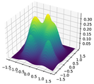{width=19% fig-align="center"}
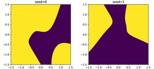{width=38% fig-align="center"}
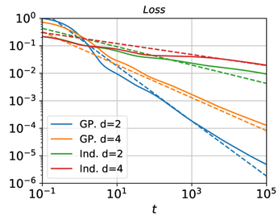{width=38% fig-align="center"}
:::

			
### Fast approximation of smooth functions 	with deep ReLU networks

Smooth functions can be typically approximated more efficiently than
non-smooth functions. Usually, this is achieved by 
choosing an approximating model of appropriate smoothness (e.g., using cubic
splines rather than linear splines if the approximated function is
smooth). However, deep neural networks can provide efficient - in a
sense, optimal - approximation rates for smooth functions even if their
activation function is only piecewise-linear such as standard ReLU [@yarotsky2017error].

::: {style="text-align: center;"}
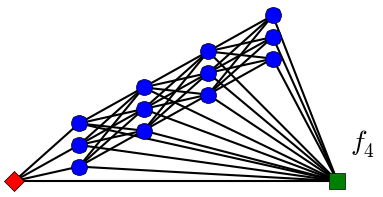{width=35% fig-align="center"}
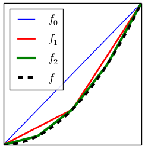{width=20% fig-align="center"}
:::

### Voxel features for 3D shape recognition
I have written a small [library](https://github.com/yarotsky/voxelfeatures) for
computation of various geometric features of voxelized 3D shapes.
These features can be used in automated classification of 3D shapes,
e.g. by training an XGBoost classifier [@yarotsky2017geometric].

::: {style="text-align: center;"}
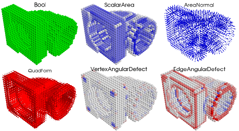{width=55% fig-align="center"}
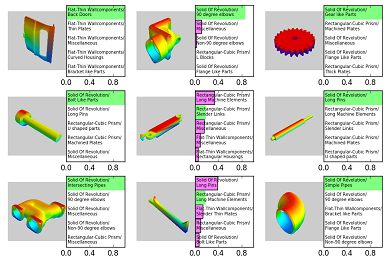{width=40% fig-align="center"}
:::

### Space tether systems

[Space tether systems](https://en.wikipedia.org/wiki/Space_tether) are an interesting class of systems, potentially useful for
various purposes such as space debris removal, satellite collocation,
etc. In a joint work with our Astrium colleagues [@alary2015dynamics] we studied a
"hub-and-spoke" pyramidal formation rotating about a central
satellite and holding another satellite beneath it. Unfortunately,
this configuration requires a relatively high fuel consumption.

So, in [@yarotsky2016three] we
proposed another, *freely moving* (no fuel!) formation serving
the same purpose. Instead of a circle, deputy satellites now move
along Lissajous curves. We find relations between the system's
parameters ensuring that the satellites and tethers never collide and
the main satellite remains immobile, and show how all these relations
can be satisfied.

Interestingly, the model seems to be especially stable if there are
at least 5 deputy satellites. Also interestingly, the tethers can get
entangled during operation; we have been able to only partially
demarcate the cases of absent or present entanglement (based on the [winding
number](https://en.wikipedia.org/wiki/Winding_number) invariant).

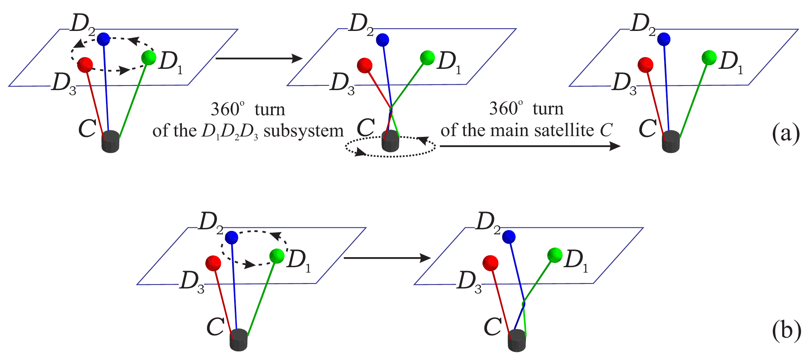{width=70% fig-align="center"}

[Watch the animation on YouTube](https://www.youtube.com/watch?v=62vSml6nXws)

### Surrogate Based Optimization (SBO)

In [this post](https://www.datadvance.net/blog/tech-tips/2015/notes-on-surrogate-based-optimization.html) 
I tried to explain in simple terms the idea of SBO and its most
natural version based on Expected Improvement (EI).

My research in this area concerned the following question: can
EI-based SBO fail, in the sense of never getting near the true global
optimum? The expected answer is "yes", but the proof is not obvious
because the behavior of SBO trajectories is not well understood on a
rigorous level. I give a
rigorous example of failure in a sort of "analytic black hole"
scenario [@yarotsky2013examples].

::: {style="text-align: center;"}
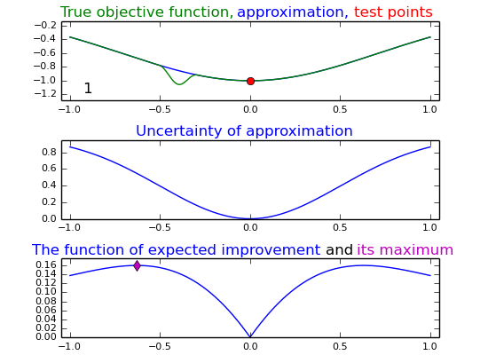{width=45% fig-align="center"}
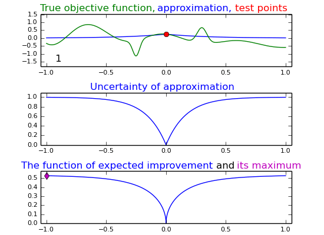{width=45% fig-align="center"}
:::

### Interpolation

Explicit error formulas seem to be rare in the approximation theory.
One well-known example is the beautiful integral error formula for the
common [polynomial interpolation](https://en.wikipedia.org/wiki/Polynomial_interpolation) with $N$ knots $x_1,\ldots,x_N$:
$$f(x)-\widehat{f}(x)=\frac{\prod_{n=1}^N (x-x_n)}{N!} \int_{s_n\ge 0,
\sum_{n=0}^N s_n=1} \frac{d^N f}{dx^N}\Big(\sum_{n=0}^N s_n x_n \Big)
d\mathbf{s},$$ 
where $x\equiv x_0$. This formula immediately
implies, for example, that the interpolants converge to the true
function if it is analytic in a sufficiently large domain. I show that this formula can be generalized to interpolation by exponential or Gaussian
functions using the Harish-Chandra-Itzykson-Zuber integral [@yarotsky2013univariate]. 

In
particular, for Gaussian basis functions $e^{-(x-x_n)^2/2}$ we get
$$f(x)-\widehat{f}(x) = \frac{ \prod_{n=1}^N (x-x_n) }{ N! Z} \int_{S^{2N+1}}
\int_{\mathbb{U}(N)} e^{\mathrm{tr}(X U^{\dagger}
P_\mathbf{v}^{\dagger} \widetilde{X} P_\mathbf{v} U)}
e^{-\frac{x^2}{2}}\Big[\prod_{n=1}^N \big(\frac{d}{dq}-x_n\big)\Big]
e^{\frac{q^2}{2}}f(q)\Big|_{q = \mathbf{v}^{\dagger}
\widetilde{X}\mathbf{v}} d\mathbf{v}dU$$ 
Though this expression looks
complicated, it can be used to prove convergence of interpolants
almost as easily as in the polynomial case. This result does not seem
to generalize to more general radial basis functions; e.g. the proof
breaks down even for basis functions of the form $\sum_{k} c_k
e^{-(x-x_n)^2/a_k}$. The HCIZ integral is well known in the random
matrix theory, representation theory and quantum field theory; it is
interesting that it also has applications to the interpolation theory.

### Quantum Spin Systems

My research in this area mostly concerned rigorous analysis of ground
states with the help of cluster expansions.

In [@yarotsky2006ground] I developed a quadratic form-based perturbation theory and used it to
prove that small perturbations of the [AKLT model](https://en.wikipedia.org/wiki/AKLT_model)
remain gapped (which was widely believed, but not easy to prove rigorously).

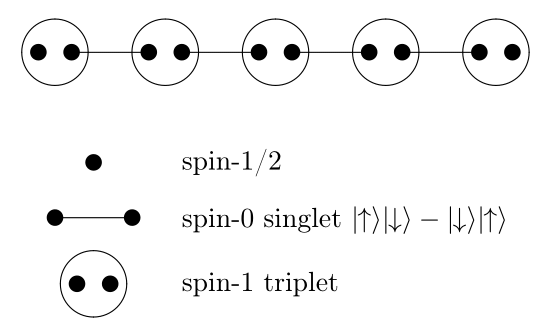{width=45% fig-align="center"}

In [@yarotsky2005uniqueness] I prove uniqueness of
the ground state of a weakly interacting system in a strong sense
involving "most general quantum boundary conditions", and discuss how
one can interprete these conditions.
		
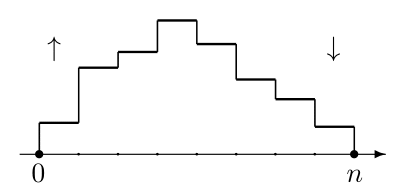{width=35% fig-align="center"}

In [@yarotsky2008random] I show that the
so-called "commensurate-incommensurate transition" in the AKLT model
can be explained by a peculiar Poisson-type random walk with a single reversal.

### My industrial experience

At Datadvance, I was one of the developers of the 
[Macros/pSeven	Core library](https://www.datadvance.net/product/pseven-core/) and other custom software for optimization and
predictive modeling. Our toolbox of regression methods is described in [@belyaev2016gtapprox].

::: {style="text-align: center;"}
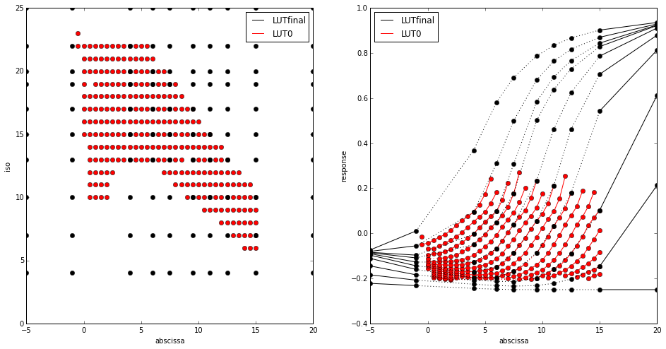{width=35% fig-align="center"}
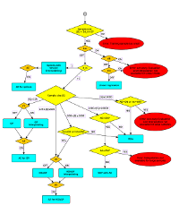{width=25% fig-align="center"}
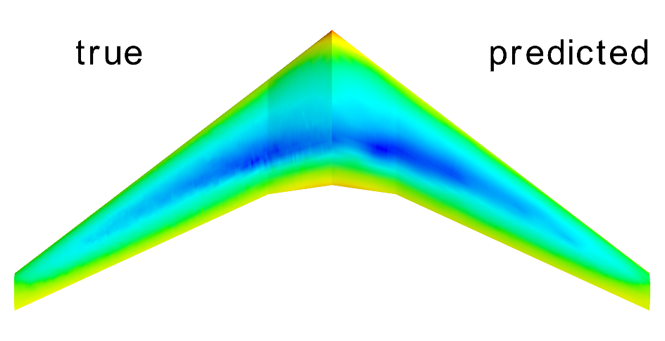{width=35% fig-align="center"}	
:::
